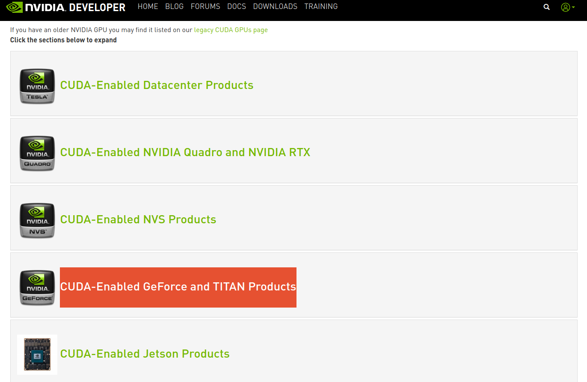
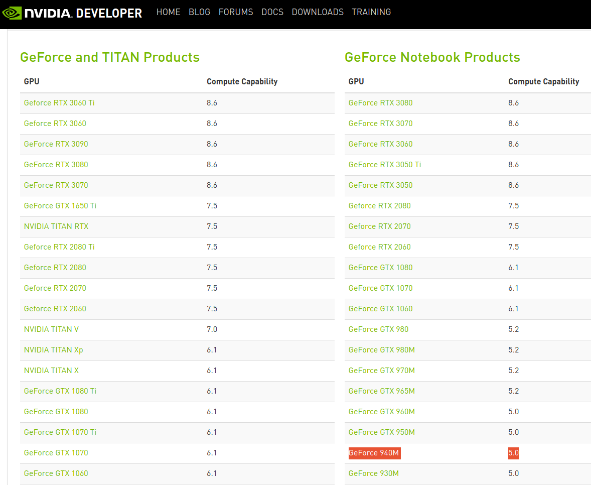

# OPENCV DNN WITH GPU

This turorial is based on: https://youtu.be/mNgC9s1Rj60

## Nvidia drivers
#### Check if it is already installed 
```
$ nvidia-smi
```
#### Install:
```
$ sudo apt-get remove --purge '^nvidia-.*' or $ sudo apt purge *nvidia*
$ sudo apt autoremove
$ sudo apt autoclean
$ sudo apt -f install
$ sudo add-apt-repository ppa:graphics-drivers/ppa
$ ubuntu-drivers devices
$ sudo ubuntu-drivers autoinstall
```
## CUDA Toolkit
#### Check if it is already installed 
```
$ nvcc --version 
```
#### Download & install
https://developer.nvidia.com/cuda-toolkit

## CUDNN
#### Download
cuDNN Library for Linux (x86_64): https://developer.nvidia.com/rdp/cudnn-archive


#### Install
Unzip the cuDNN package.
```
$ cd Downloads
$ tar -xvf cudnn-linux-x86_64-8.x.x.x_cudaX.Y-archive.tar.xz
```
Copy the following files into the CUDA toolkit directory.
```
$ sudo cp cuda/include/cudnn*.h /usr/local/cuda/include 
$ sudo cp -P cuda/lib64/libcudnn* /usr/local/cuda/lib64 
$ sudo chmod a+r /usr/local/cuda/include/cudnn*.h /usr/local/cuda/lib64/libcudnn*
```

**Official install-guide (Tar File Installation):** https://docs.nvidia.com/deeplearning/cudnn/install-guide/index.html#installlinux-tar

## Compile and install opencv with cuda

#### Install dependencies
```
$ sudo apt-get update
$ sudo apt-get upgrade
$ sudo apt install gcc-8 g++-8
$ sudo apt-get install build-essential cmake unzip pkg-config
$ sudo apt-get install libjpeg-dev libpng-dev libtiff-dev
$ sudo apt-get install libavcodec-dev libavformat-dev libswscale-dev
$ sudo apt-get install libv4l-dev libxvidcore-dev libx264-dev
$ sudo apt-get install libgtk-3-dev
$ sudo apt-get install libatlas-base-dev gfortran
$ sudo apt-get install python3-dev
```

#### Clone the opencv repositories
```
$ cd ~
$ git clone https://github.com/opencv/opencv.git
$ git clone https://github.com/opencv/opencv_contrib.git
```

#### Compile opencv
```
$ cd opencv
$ mkdir build
$ cd build
```

Determine your CUDA architecture version: https://developer.nvidia.com/cuda-gpus

My GPU is ***GeForce 940M***

Select CUDA GPU:



Get Compute Capability:



Compute Capability of my GPU is **5.0** which is going to be **CUDA_ARCH_BIN** value in the next command.

```
$ cmake -D CMAKE_BUILD_TYPE=RELEASE \
-D CMAKE_C_COMPILER=/usr/bin/gcc-8 \
-D CMAKE_INSTALL_PREFIX=/usr/local \
-D INSTALL_PYTHON_EXAMPLES=ON \
-D INSTALL_C_EXAMPLES=OFF \
-D WITH_TBB=ON \D WITH_V4L=ON \
-D WITH_QT=OFF \
-D WITH_OPENGL=ON \
-D WITH_GSTREAMER=ON \
-D OPENCV_GENERATE_PKGCONFIG=ON \
-D OPENCV_PC_FILE_NAME=opencv.pc \
-D OPENCV_ENABLE_NONFREE=ON \
-D OPENCV_PYTHON3_INSTALL_PATH=$HOME/.local/lib/python3.8/site-packages \
-D OPENCV_EXTRA_MODULES_PATH=~/opencv_contrib/modules \ \
-D PYTHON_EXECUTABLE=/usr/bin/python3 \
-D BUILD_EXAMPLES=ON \
-D WITH_CUDA=ON \
-D WITH_CUDNN=ON \
-D OPENCV_DNN_CUDA=ON \
-D ENABLE_FAST_MATH=1 \
-D CUDA_FAST_MATH=1 \
-D CUDA_ARCH_BIN=your CUDA architecture version (in my case it is 5.0) \
-D BUILD_opencv_cudacodec=OFF \
-D WITH_CUBLAS=1 \
-D CUDNN_LIBRARY=/usr/local/cuda-11.5/lib64/libcudnn.so \
-D CUDNN_INCLUDE_DIR=/usr/local/cuda-11.5/include  ..
```

cuda-11.5 => my cuda folder, yours could be named different like only 'cuda'

Command nproc prints the number of processing units available in the device
Use this number to compile opencv: make -jnproc
```
$ nproc
```

if nproc = 4
```
$ make -j4
```
***(This can take a little while, go get a cup of coffee)***


#### Install opencv
```
$ sudo make install
```

#### Test
```
$ cd ~
$ python
>> import cv2
>> print(cv2.getBuildInformation())
```

You can test it on your webcam:

Some weights:
https://github.com/AlexeyAB/darknet/releases/

Cfgs: 
https://github.com/Tianxiaomo/pytorch-YOLOv4/tree/master/cfg


coco.names: https://github.com/pjreddie/darknet/tree/master/data

```
$ python test.py

```

